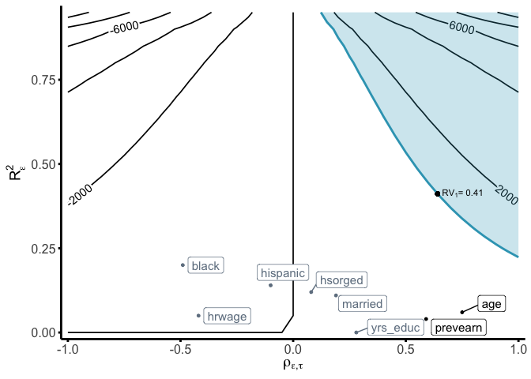

<!-- README.md is generated from README.Rmd. Please edit that file -->

# senseweight

<!-- badges: start -->
<!-- badges: end -->

`senseweight` implements a set of sensitivity functions and tools to
help researchers transparently conduct sensitivity analyses for weighted
estimators. `senseweight` allows researchers to assess the sensitivity
present in their weighted estimates to omitted confounders. Specific
methods provided in `senseweight` include the following: (1)
visualization tools to summarize sensitivity; (2) summary tables
containing necessary sensitivity statistics; (3) formal benchmarking
methods which allow researchers to use observed covariates to assess the
plausibility of different confounders.

## Installation

You can install the development version of senseweight from
[GitHub](https://github.com/) with:

``` r
# install.packages("devtools")
devtools::install_github("melodyyhuang/senseweight")
```

## Citation

[Huang, Melody. “Sensitivity Analysis in the Generalization of
Experimental Results.” Journal of the Royal Statistical Society Series
A: Statistics in Society
(2024)](https://academic.oup.com/jrsssa/advance-article-abstract/doi/10.1093/jrsssa/qnae012/7626119)

## Basic Usage

The example below illustrates how to use the `senseweight` package for
external validity. Examples of how to use `senseweight` for internal
validity or survey weighting are forthcoming.

``` r
library(senseweight)

# Load in JTPA data:
data(jtpa_women)
```

``` r
# Summarize sites
jtpa_women |>
  group_by(site) |>
  summarize(
    length(prevearn),
    across(
      c(prevearn, age, married, hrwage, black, hispanic, hsorged, yrs_educ), 
      mean
    )
  )
#> # A tibble: 16 × 10
#>    site  `length(prevearn)` prevearn   age married hrwage   black hispanic
#>    <chr>              <int>    <dbl> <dbl>   <dbl>  <dbl>   <dbl>    <dbl>
#>  1 CC                   524    1855.  32.1  0.219    479. 0.101    0.693  
#>  2 CI                   190    2250.  33.5  0.253    458. 0.0684   0.0105 
#>  3 CV                   788    2192.  33.6  0.278    455. 0.173    0.00635
#>  4 HF                   234    1997.  31.6  0.184    455. 0.432    0.0342 
#>  5 IN                  1392    3172.  34.9  0.193    466. 0.243    0.0194 
#>  6 JC                    81    2564.  30.6  0.136    531. 0.642    0.247  
#>  7 JK                   353    1928.  30.0  0.113    453. 0.912    0      
#>  8 LC                   485    3039.  33.9  0.258    464. 0.0165   0.165  
#>  9 MD                   177    2915.  34.6  0.181    480. 0.367    0      
#> 10 MN                   179    2215.  37.6  0.352    454. 0.00559  0.0782 
#> 11 MT                    38    1680.  33.8  0.395    474. 0        0.0526 
#> 12 NE                   636    2161.  31.7  0.0975   477. 0.511    0.0377 
#> 13 OH                    74    2568.  34.6  0.324    486. 0.0135   0      
#> 14 OK                    87    2320.  37.3  0.126    586. 0.759    0.0805 
#> 15 PR                   463    1783.  32.8  0.0842   506. 0.268    0.378  
#> 16 SM                   401    2997.  32.2  0.284    429. 0.0200   0.00249
#> # ℹ 2 more variables: hsorged <dbl>, yrs_educ <dbl>
```

Assume researchers are interested in generalizing the results from the
site of Omaha, Nebraska to the other 15 experimental sites:

``` r
site_name <- "NE"
df_site <- jtpa_women[which(jtpa_women$site == site_name), ]
df_else <- jtpa_women[which(jtpa_women$site != site_name), ]

# Estimate unweighted estimator:
model_dim <- estimatr::lm_robust(Y ~ T, data = df_site)
PATE <- coef(lm(Y ~ T, data = df_else))[2]
DiM <- coef(model_dim)[2]

# Generate weights using observed covariates:
df_all <- jtpa_women
df_all$S <- ifelse(jtpa_women$site == "NE", 1, 0)
model_ps <- WeightIt::weightit(
  (1 - S) ~ . - site - T - Y, 
  data = df_all, method = "ebal", estimand = "ATT"
)
weights <- model_ps$weights[df_all$S == 1]

# Estimate IPW model:
model_ipw <- estimatr::lm_robust(Y ~ T, data = df_site, weights = weights)
ipw <- coef(model_ipw)[2]

# Estimate bound for var(tau):
m <- sqrt(var(df_site$Y[df_site$T == 1]) / var(df_site$Y[df_site$T == 0]))
# Since m > 1:
vartau <- var(df_site$Y[df_site$T == 1]) - var(df_site$Y[df_site$T == 0])
```

### Sensitivity Summary Measures

We can generate the sensitivity summary measures using the
`summarize_sensitivity` function:

``` r
summarize_sensitivity(
  weights = weights, 
  Y = df_site$Y, 
  Z = df_site$T, 
  sigma2 = vartau, 
  estimand = "PATE"
)
#>   Unweighted Unweighted_SE Estimate     SE   RV sigma_tau_bound cor_w
#> Z    1107.35        982.65  1356.66 1417.3 0.36          2897.9  0.07
```

The `summarize_sensitivity` function defaults to evaluating the
robustness value at `q=1`, indicating a robustness value, relative to a
bias equal to the point estimate. Researchers can specify different
values for `q` in the function. In the generalization setting,
researchers can modify the `sigma2` bound and posit their own values for
a plausible bound (given substantive justification). With no
specification, `sigma2` will be automatically calculated to be bound by
`var(Y(1)) + var(Y(0))`.

Individual components of the sensitivity summaries can be computed as
well:

``` r
# Calculate robustness value:
RV <- robustness_value(
  estimate = ipw, b_star = 0, sigma2 = vartau, weights = weights
)
print(RV)
#> [1] 0.4113622
```

### Formal Benchmarking:

``` r
# Select weighting variables:
weighting_vars <- names(df_all)[which(!names(df_all) %in% c("site", "S", "Y", "T"))]

# Run bechmarking:
df_benchmark <- run_benchmarking(
  weighting_vars,
  data = df_all[, -1],
  treatment = "T", outcome = "Y", selection = "S",
  estimate = ipw,
  RV = RV, sigma2 = vartau,
  estimand = "PATE"
)

print(df_benchmark)
#>   variable R2_benchmark rho_benchmark    bias   MRCS k_sigma_min k_rho_min
#> 1 prevearn         0.04          0.59  311.06   4.36        9.99      1.08
#> 2      age         0.06          0.75  479.43   2.83        6.91      0.85
#> 3  married         0.11          0.19  171.30   7.92        3.82      3.29
#> 4   hrwage         0.05         -0.42 -245.12  -5.53        8.32     -1.51
#> 5    black         0.20         -0.49 -627.68  -2.16        2.03     -1.30
#> 6 hispanic         0.14         -0.10  -96.85 -14.01        3.01     -6.66
#> 7  hsorged         0.12          0.08   74.52  18.20        3.51      7.94
#> 8 yrs_educ         0.00          0.28   22.79  59.54      408.90      2.26
```

### Generating the Bias Contour Plots

``` r
contour_plot(
  var(weights), vartau, ipw, df_benchmark,
  benchmark = TRUE, shade = TRUE,
  shade_var = c("age", "prevearn"),
  label_size = 4
) +
  geom_point(aes(x = RV, y = sqrt(RV))) +
  annotate("text",
    x = RV - 0.01, y = sqrt(RV) + 0.02,
    label = expression(RV[1] * "= 0.41"), hjust = 0, vjust = 0, size = 3
  )
```



## Shiny senseweight app

The `senseweight` package also includes a Shiny app that allows users to
interactively conduct sensitivity analyses. The app is available
[here](https://tiffanymtang.shinyapps.io/senseweight/). The app can also
be run locally by running:

``` r
run_app()
```

<figure>

<figcaption aria-hidden="true">shinysenseweight</figcaption>
</figure>
